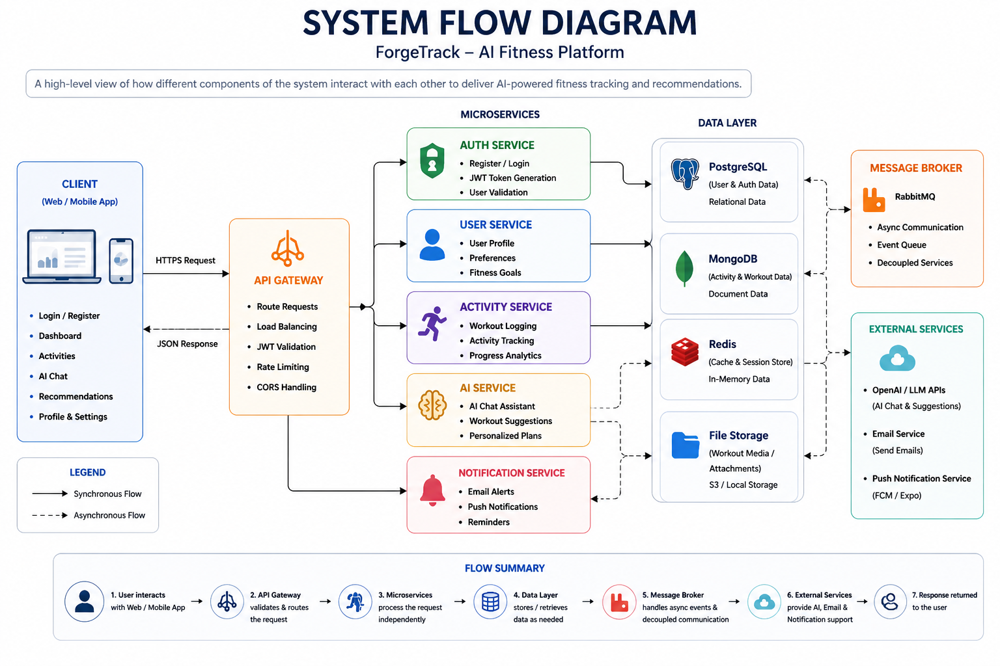
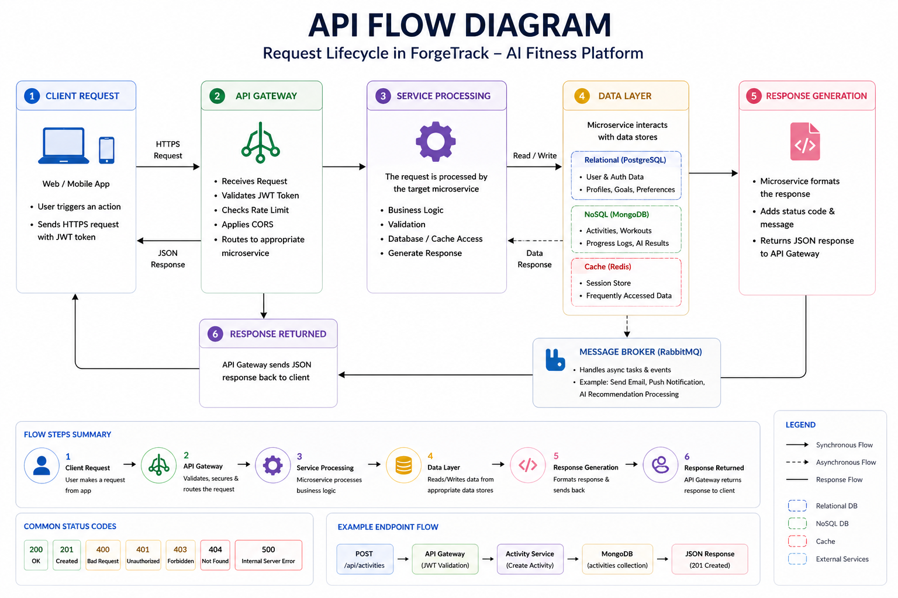
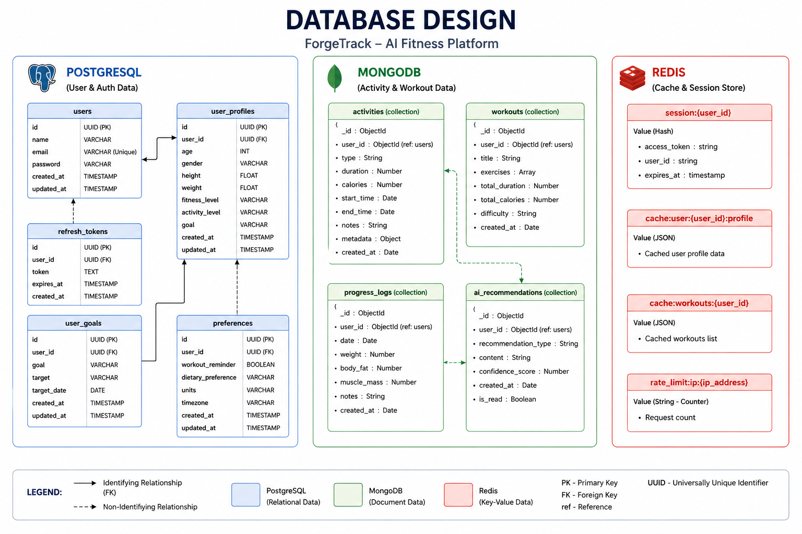

# 🚀 ForgeTrack – Microservices AI Fitness Platform

A full-stack AI-powered fitness tracking platform built using microservices architecture.

This system provides user authentication, activity tracking, AI recommendations, and analytics — all routed through a centralized API Gateway.

---

## 🧠 Architecture Overview

---

## ⚙️ System Flow

---

## 🔄 API Flow

---

## 🗄️ Database Design

---

## 🧩 Tech Stack

### Frontend
- React (Vite)
- Tailwind CSS
- Redux Toolkit

### Backend (Microservices)
- Spring Boot
- Spring Cloud Gateway
- Eureka (Service Discovery)
- Config Server

### Databases
- PostgreSQL (User/Auth Data)
- MongoDB (Activities & AI Data)
- Redis (Cache & Sessions)

### Messaging
- Kafka (Event Streaming)

### DevOps
- Docker
- Docker Compose

---

## 📁 Project Structure

MicroServices-AI-FitnessApp/
│
├── fitness-frontend/
├── fitness-backend/
│   ├── gateway/
│   ├── userservice/
│   ├── activityservice/
│   ├── aiservice/
│   ├── authservice/
│   ├── eureka/
│   ├── configserver/
│
├── assets/
└── README.md

---

## 🔐 Features

- JWT Authentication  
- API Gateway Routing  
- Microservices Communication  
- Activity Tracking System  
- AI Chat & Recommendations  
- Role-Based Access (Admin/User)  
- Redis Caching  
- Kafka Event Streaming  

---

## 📸 Frontend Screenshots

### Dashboard

### Activities

### AI Chat

### AI Recommendations

### Login

### Register

---

## 📡 API Testing (Postman)

### Login API

### Get Users

### AI Chat

---

## 🐳 Running with Docker

### ⚠️ Service Startup Order (IMPORTANT)

Services must start in this order:

1. Config Server  
2. Eureka Server  
3. Gateway  
4. User Service  
5. Other Services (Activity, AI, Auth)

---

### 🚀 Start All Services

docker-compose up --build

---

### 🛑 Stop All Services

docker-compose down

---

## 🌐 Access Points

| Service | URL |
|--------|------|
| Frontend | http://localhost:5173 |
| Gateway | http://localhost:8084 |
| Eureka Dashboard | http://localhost:8761 |
| Config Server | http://localhost:8888 |

---

## ⚠️ Important Notes

- All backend services are not directly accessible  
- All requests must go through API Gateway (8084)  
- Configure environment variables properly  
- Do not hardcode API URLs in frontend  

---

## 🚧 Future Improvements

- Rate limiting optimization  
- Distributed tracing (Zipkin)  
- Circuit breaker (Resilience4j)  
- CI/CD pipeline  
- Kubernetes deployment  

---

## 👨‍💻 Author

Hardik Gupta
