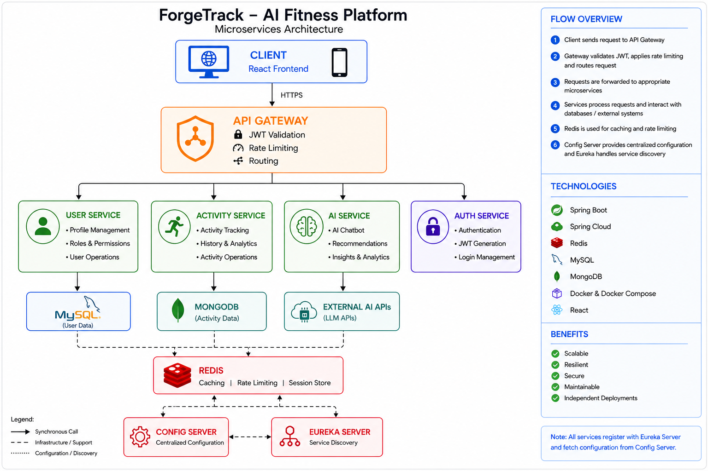
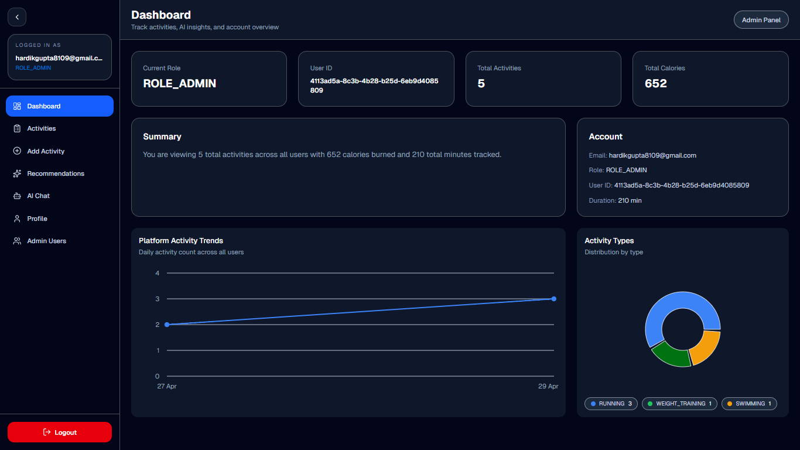
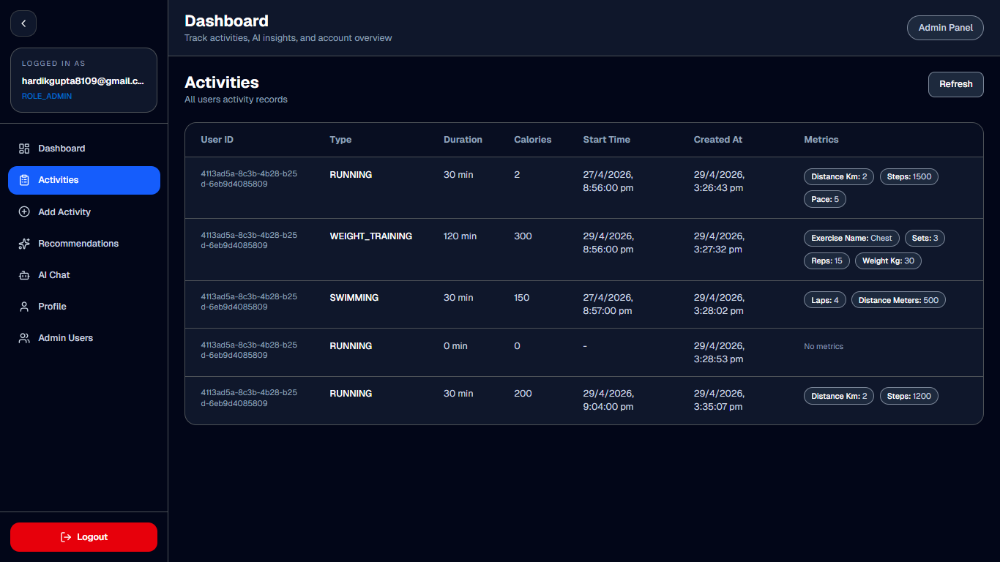
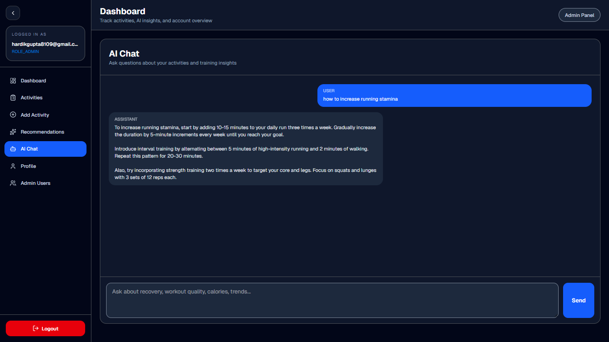
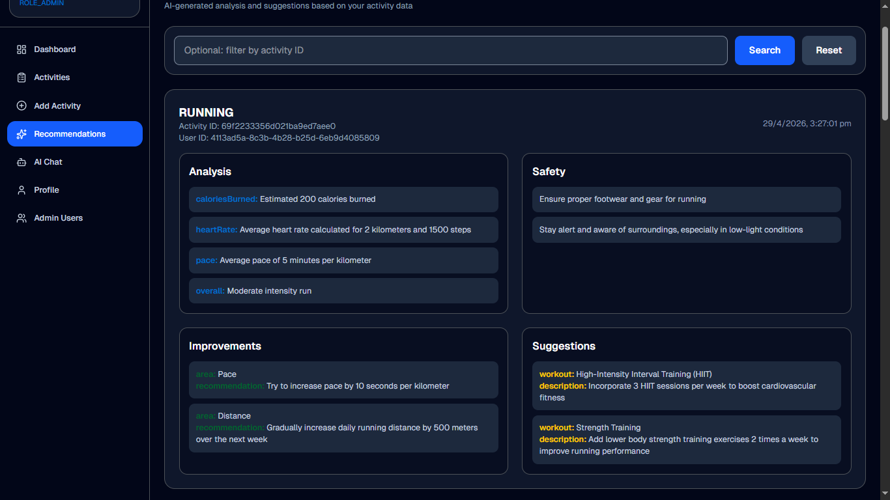
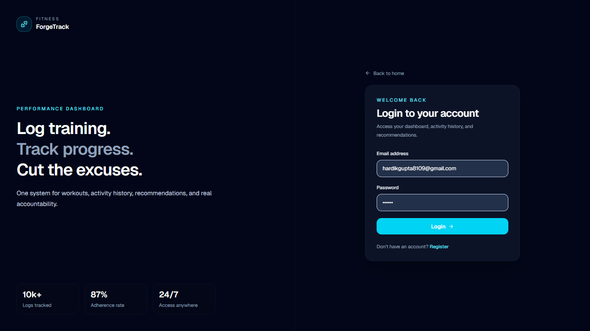
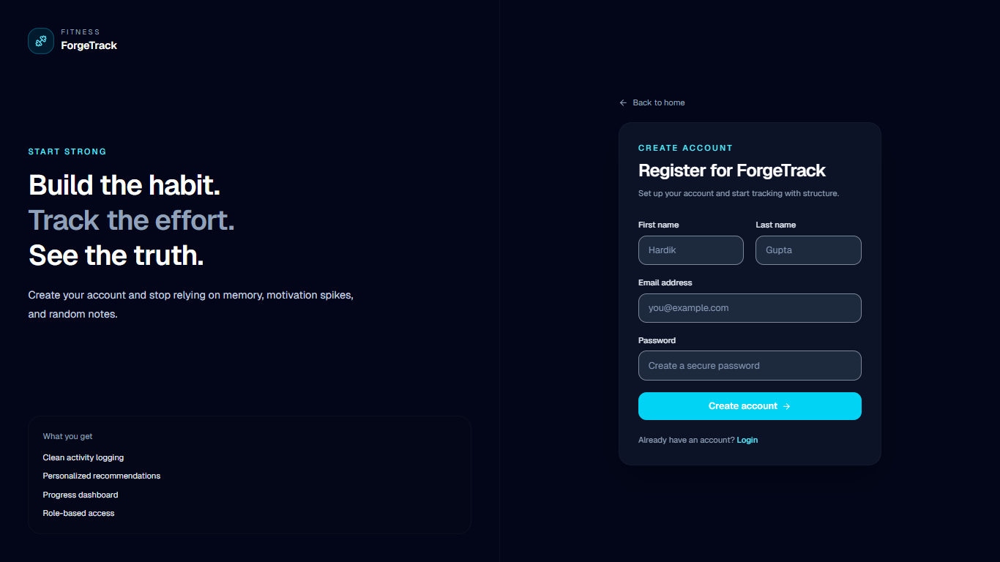
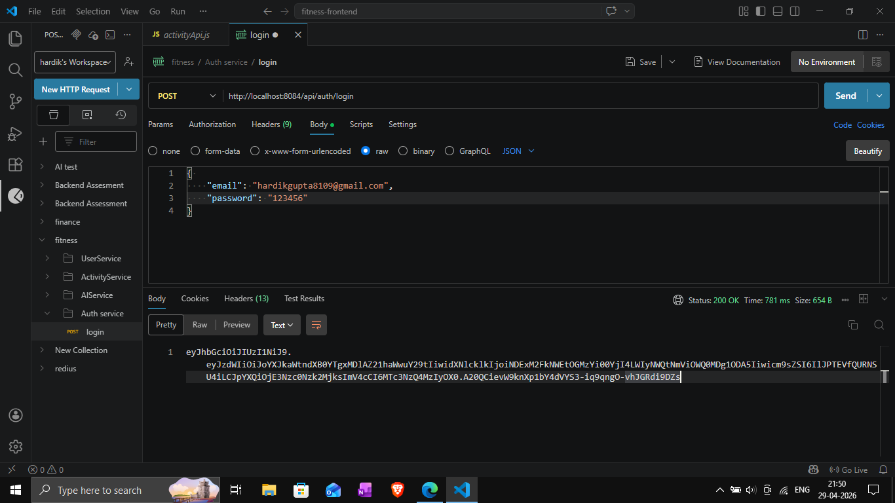
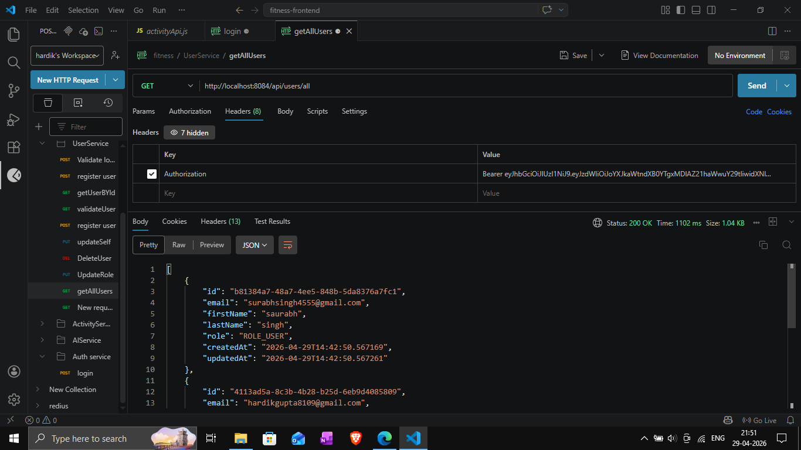
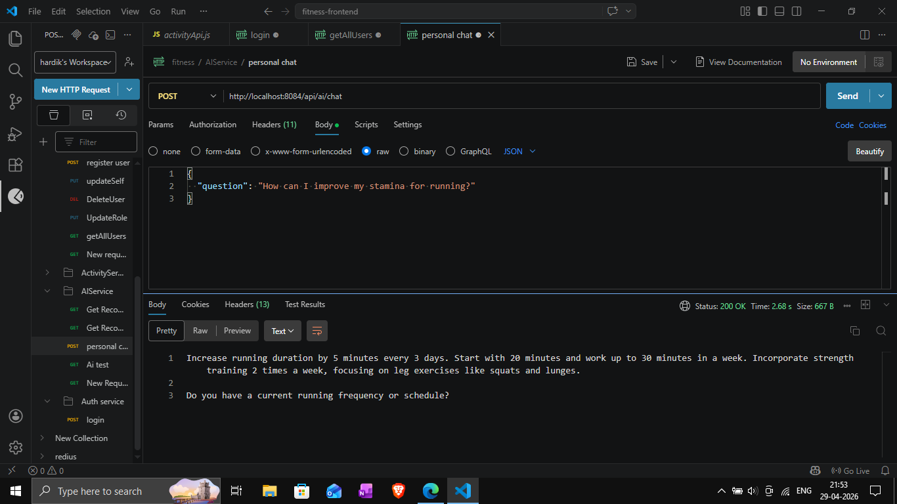

# 🚀 ForgeTrack – AI-Powered Microservices Fitness Platform

ForgeTrack is a fully containerized microservices-based fitness platform that integrates AI-driven recommendations, event-driven communication, and layered security.

The system is designed to simulate real-world distributed architecture with controlled access, resilience mechanisms, and scalable communication patterns.

---

## 🧠 Architecture Overview



Core architecture components:

- API Gateway (single entry point)
- Eureka (service discovery)
- Config Server (central configuration)
- Kafka (event-driven communication)
- Redis (caching + rate limiting)
- Polyglot databases (PostgreSQL + MongoDB)

---

## ⚙️ System Flow


1. Frontend sends request → Gateway  
2. Gateway applies rate limiting + JWT validation  
3. Request routed to target microservice  
4. Service validates JWT independently  
5. Service interacts with DB / Kafka / Redis  
6. Response returned via Gateway  

---

## 🔄 API Flow


- All requests pass through the API Gateway  
- Gateway handles authentication, routing, and filtering  
- Services are not directly exposed  
- Clean separation of concerns between services  

---

## 🗄️ Database Design


Polyglot persistence strategy:

- PostgreSQL → user & authentication data  
- MongoDB → activity tracking & AI data  
- Redis → caching & rate limiting  

---

## 🔐 Security Model

### 🔒 Gateway-Level Protection

- All services are **hidden from public access**  
- Only Gateway is exposed externally  
- Pre-auth rate limiting applied  

---

### 🔑 Service-Level Security

- Each microservice **validates JWT independently**  
- No blind trust on Gateway headers  
- Role-based access supported  

---

### ⚠️ Current Limitations

- Shared secret-based JWT (no RSA)  
- No OAuth2 authorization server  
- No token revocation/blacklist  

---

## ⚡ Rate Limiting (Layered + Redis-Based)

### 🔹 Gateway-Level (Pre-Auth)

- Blocks excessive requests before authentication  
- Prevents spam and brute-force attacks  

---

### 🔹 Service-Level (Post-Auth)

- Per-user request limiting  
- Implemented using Redis counters  

---

### 🧠 Implementation Details

- Redis used for distributed counting  
- Simple counter-based approach  
- Returns `429 Too Many Requests` on limit breach  

---

### ⚠️ Limitations

- Fixed window logic (not sliding window/token bucket)  
- No global limit across all services  
- No adaptive rate control  

---

## 🤖 AI System Design

### 🔄 Multi-Provider Fallback

 ```
OpenRouter → Groq → Gemini → Static Response
```


### ⚙️ Behavior

1. Primary provider called  
2. On failure → fallback to next provider  
3. If all fail → return safe default response  

---

### ✅ Advantages

- Prevents total system failure  
- Ensures consistent user experience  
- Reduces dependency on single provider  

---

### ⚠️ Limitations

- Sequential fallback (adds latency)  
- No retry or timeout optimization  
- No circuit breaker  

---

## 🧠 AI Response Control (Prompt Conditioning)

- AI responses are constrained using backend prompts  
- Focused on fitness & health domain  
- Prevents irrelevant outputs  

---

### ⚠️ Limitations

- No conversation memory  
- No personalization  
- Not true contextual AI  

---

## ⚖️ Engineering Trade-offs

- Simpler fallback vs complex resilience system  
- Prompt conditioning vs full AI memory  
- Redis counters vs advanced rate limiting algorithms  
- JWT-based auth vs OAuth2  

These decisions prioritize simplicity while demonstrating core system design concepts.

---

## 🧩 Tech Stack

### Frontend
- React (Vite)
- Tailwind CSS
- Redux Toolkit

### Backend
- Spring Boot Microservices
- Spring Cloud Gateway
- Eureka + Config Server

### Databases
- PostgreSQL (User/Auth)
- MongoDB (Activity/AI)
- Redis (Cache + Rate Limiting)

### Messaging
- Kafka (Event-driven architecture)

### DevOps
- Docker + Docker Compose

---

# 🐳 Running the System (Docker Only)

## ⚠️ Internal Startup Sequence

1. Config Server  
2. Eureka Server  
3. Gateway  
4. Core Services (User, Auth)  
5. Activity & AI Services  
6. Frontend  

---

## 🚀 Start Everything

```bash
docker compose up --build
```

# 🛑 Stop
```
docker compose down
```
---

# 📁 Project Structure

```
MicroServices-AI-FitnessApp/
│
├── fitness-frontend/
│ ├── src/
│ ├── public/
│ ├── package.json
│ └── vite.config.js
│
├── fitness-backend/
│ ├── gateway/
│ ├── userservice/
│ ├── activityservice/
│ ├── aiservice/
│ ├── authservice/
│ ├── eureka/
│ ├── configserver/
│ └── docker-compose.yml
│
├── assets/
│ ├── architecture.png
│ ├── System-flow Diagram.png
│ ├── API-Flow Diagram.png
│ ├── Database design.png
│ ├── Dashboard.png
│ ├── Activities.png
│ ├── AI-Chat.png
│ ├── AI-Recommendations.png
│ ├── Login.png
│ ├── Register.png
│ ├── postman-AI-chatbot.png
│ ├── postman-getAllUsers.png
│ └── postman-login.png
│
├── .gitignore
└── README.md
```

---

| Service       | URL                                            |
| ------------- | ---------------------------------------------- |
| Frontend      | [http://localhost:5173](http://localhost:5173) |
| Gateway       | [http://localhost:8084](http://localhost:8084) |
| Eureka        | [http://localhost:8761](http://localhost:8761) |
| Config Server | [http://localhost:8888](http://localhost:8888) |
| Redis Insight | [http://localhost:5541](http://localhost:5541) |

---

## ⚠️ Important Rules

- ❌ Do NOT access services directly  
- ✅ Always use Gateway  
- ❌ Do NOT expose internal ports  
- ✅ All traffic flows through Gateway  

---

## ⚡ Event-Driven Architecture (Kafka)

Kafka is used for asynchronous communication.

### 🔄 Flow

1. Service publishes event  
2. Kafka broker processes event  
3. Other services consume asynchronously  

---

### 📌 Example

- Activity created → event published  
- AI service consumes → generates recommendation  

---

### 🤔 Why Kafka?

- Decouples services  
- Improves scalability  
- Enables async workflows  

---

## 📸 Frontend Screenshots

### Dashboard


### Activities


### AI Chat


### AI Recommendations


### Login


### Register


---

## 📡 API Testing (Postman)

### Login API


### Get Users


### AI Chat


---

## 🚀 Future Improvements

### 🔐 Security
- OAuth2 / Authorization Server  
- JWT using public/private keys  
- Token revocation  

### ⚙️ Resilience
- Circuit breaker (Resilience4j)  
- Retry mechanisms  
- Dead-letter queues  

### 📊 Observability
- Centralized logging (ELK)  
- Metrics (Prometheus)  
- Tracing (Zipkin)  

### ⚡ Performance
- AI response caching (Redis)  
- Query optimization  
- Better indexing  

### 🧠 AI Enhancements
- Conversation memory  
- Context-aware responses  
- Smart provider selection  
- Cost optimization  

---

## 🧪 What This Project Demonstrates

- Distributed system design  
- Layered security architecture  
- Event-driven microservices  
- AI integration with fallback handling  
- Scalable backend design patterns  

---

## ❗ Scope & Reality

This project is designed to demonstrate real-world microservices architecture concepts, including:

- API Gateway routing  
- Service discovery  
- Event-driven communication  
- Layered security  
- AI integration with fallback handling  

While not production-hardened, the system reflects practical design patterns used in scalable distributed systems and can be extended with enterprise-grade components. 

---

## 👨‍💻 Author

Hardik Gupta
Email: hardikgupta8109@gmail.com
